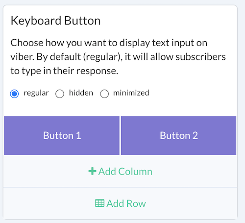
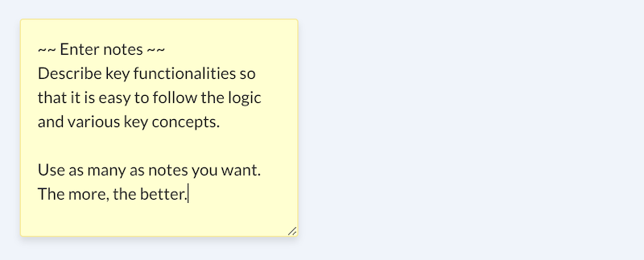

# Release Notes

**Smartloop 2020.08.18**

*Viber*

Viber keyboard button updates. This allows you to set additonal attributes for your __keyboard button__ and send it separately after any message.

Note: existing keyboard button will work as it is, in order to take advantage of this new feature, you will need to add/remove your __keyboard button__.

*Web*

Attachment support, now you can send image in a website bot, this will allow to you capture screenshots using *user-input* plugin from a webiste bot

**Smartloop 2020.02.20**

_February 20, 2020_

New notes plugin. Take notes as you build conversation flow. It improves the readability of your bot for your teams to understand various concepts and design decisions.

>
> We're Here to Help!
> Need help? If you can’t find the answer you’re looking for in this documentation, get in touch with us by [hello@smartloop.ai](mailto:hello@smartloop.ai>)
