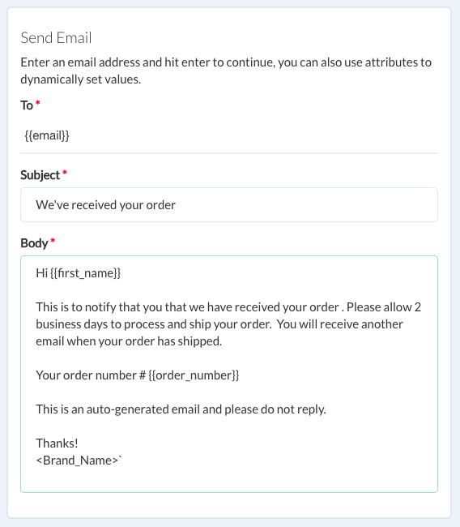

# Send Email Notification

::: warning Not supported in Test mode
You will need to test `send email` in the bot itself. It will be skipped in the test bot.
:::

Use the "Send Email" to dynamicaly to send out email notifications to your customers to notify them of an update or send them out any promitional contents.

Click to drop the _Send Email_ plugin to a block.

You can use the email plugin to send out notifcations for the following type of usecases:

* Send email when user does some actions, like order pizza using your bot
* Send a follow up email using campaign after some events or just to re-target your leads. Very useful for website bots. Make sure to collect email and use it as an attribute to send out notifcations.
* Notify yourself when some reaches to a certain point of your bot or requests something (e.g.live-chat). Use the `owner_id` attribute to send email to the owner of account.

## Configure
You can use various [user attributes](./user-attributes.md) to dynamically create your content.

The email is sent from `no-reply at smartloop.ai`. However, it uses the name of your `bot` as a sender name.
