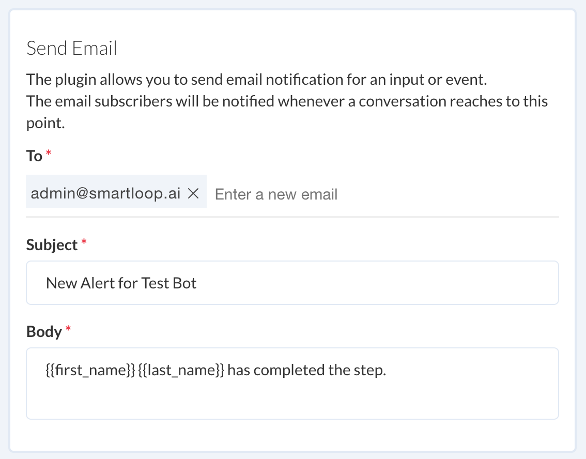

# Send Email Notification

Use the "Send Email" plugin to send out a notification when a conversation reaches a certain point. 

Click to drop the _Send Email_ plugin to a block.

## Configure

* Enter an email address where you would like to receive a notification. Hit Enter.
* Specify a Subject, that will let you label the message.
* Describe the scenario or pass in attributes to track.

You can send various [user attributes](./user-attributes.md) to debug and understand a context.

Once everything configured correctly, you should receive an email from `no-reply at smartloop.ai`
