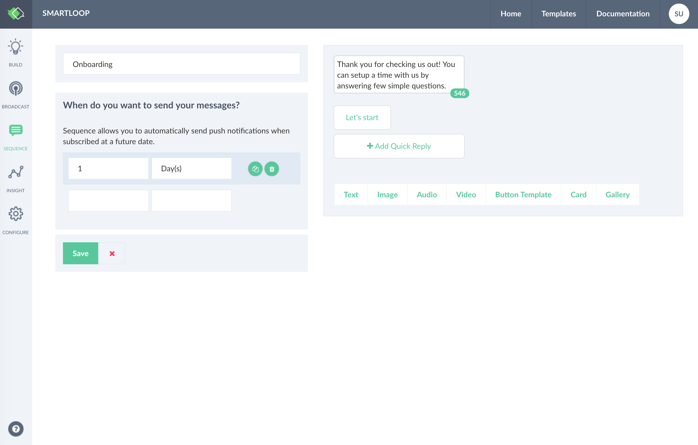
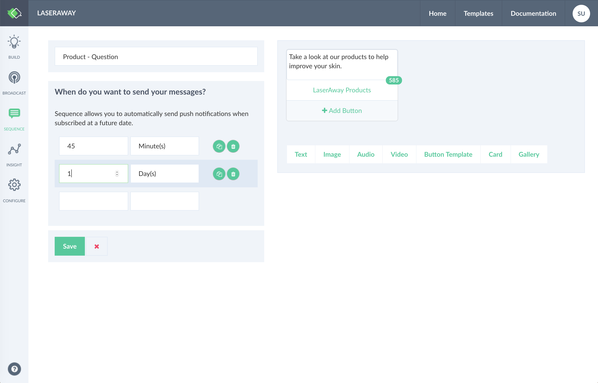
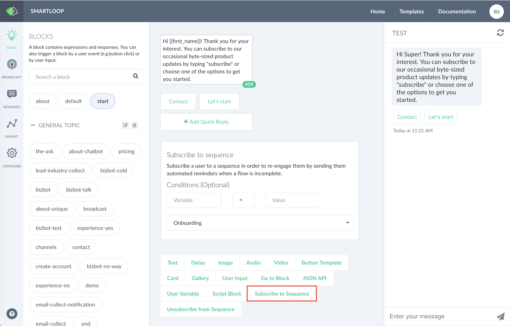

# Engage Users with Sequence

Sequence capabilities enable you to engage your users at a later time. The basic building blocks of a sequence are to nurture and drive the user back to the flow to engage with your product or service.

Head to the sequence section by clicking on the sequence icon as shown below:

Click on the "+ New Sequence". 

Here, I want to create an on-boarding engagement where it will send out a message to the user after a day from first interaction.

Sequence lets you create multiple engagements from a single point of entry. The following example shows different engagement segments for interaction. 

Once you have your sequence created, the next step is to subscribe to it. From the toolbar add the "Subscribe to Sequence" plugin to your conversation and select the sequence from the drop-down that you have just created.

::: tip
Unsubscribing a sequence will cancel the sequence and it will be restarted next time it is initialized using `subscribe-to-sequence` plugin.
:::

Here, you can subscribe a user to a flow based on conditions and user variables and you can do the same when unsubscribing.

When the conversation flow hits this plugin, it will remove the user from the engage flow and will mark the sequence as cancel for the user.

Finally, test your engagement by connecting your bot to a channel. Note that live preview will skip the initialization of sequence. 