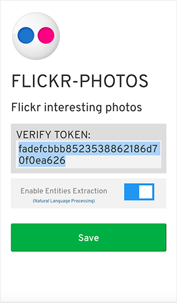

# Setup Webhook

Scroll down on the App Dashboard to “Setup Webhooks”

Put in the bot URL from the command prompt in the Webhook callback URL.

Select the first five categories. Copy & paste the `verify token` from your bot dashboard

Click "Verify and Save"
