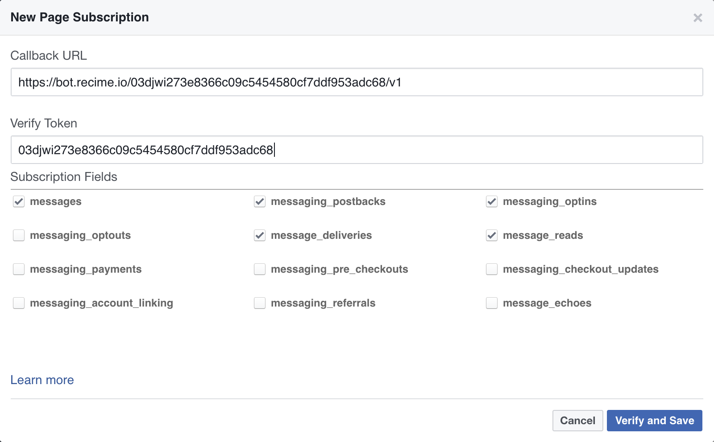
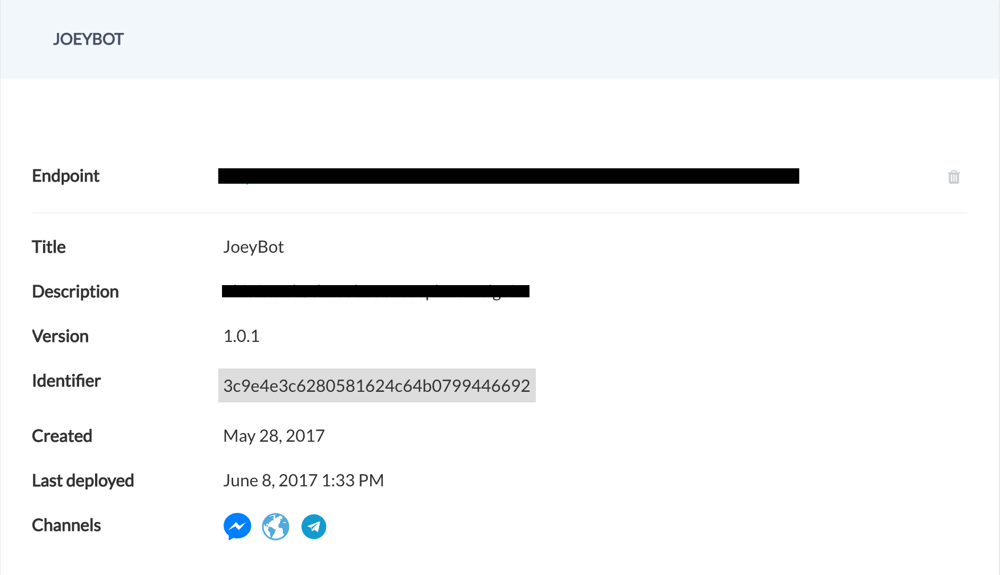

# Setup Webhook

Go back to your Facebook Developer dashboard for your bot. Scroll down on to “Setup Webhooks”.

Put in the bot URL from the command prompt in the Webhook callback URL.

Select five categories (messages, messaging_postbacks, messaging_optins, message_deliveries, message_reads). From [Recime dashboard](https://console.recime.io) copy/paste the `identifier` into the **Facebook Verify Token** textbox.

