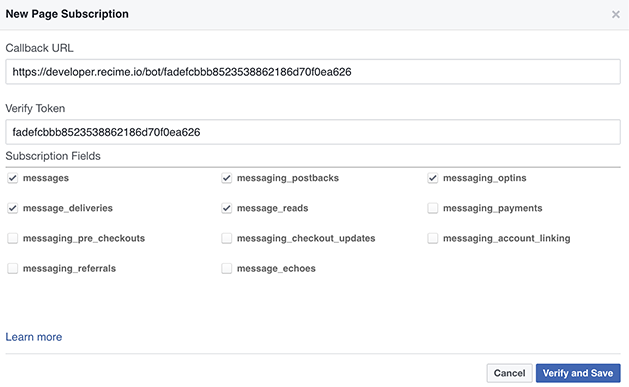
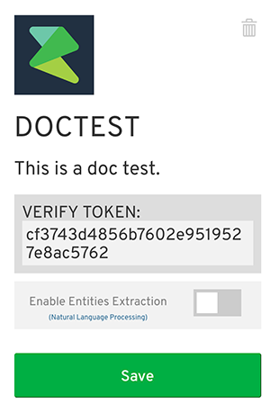

# Setup Webhook

Go back to your Facebook Developer dashboard for your bot. Scroll down on to “Setup Webhooks”.

Put in the bot URL from the command prompt in the Webhook callback URL.

Select five categories (messages, messaging_postbacks, messaging_optins, message_deliveries, message_reads). Then visit your [Recime dashboard](https://developer.recime.io/account), click on your bot and copy/paste the `verify token` from your bot into the Facebook Verify Token.

Click "Verify and Save"
