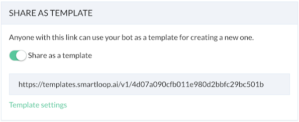

# Sharing

## Template

Every bot you create can be shared as a template.

Whether you are working on a messenger, web or Viber bot or an individual, freelancer, or an agency, you can share your bot as a template with clients and community easily.

Similarly, you can reuse a marketing campaign or lead capture bot using templates.

Go to the bot settings and click on the "Share as a Template," this will prompt a dialog briefly describe your bot, upload icon, and add steps to use your template.

You can put this link on your website or social media, for anyone to take advantage of it. Once someone clicks on "Use Template" button (example below), the will be available to them automatically and a copy of it is available in their dashboard. They can continue to connect the bot to Facebook or other channels with the click of a button.

By default, templates are private and are only available via the secure link.

If you want to submit your template to our gallery, then please send us an email at [support@smartloop.ai](support@smartloop.ai)

## Collaborators

If you are an admin or owner of the bot, you can invite collaborators. 

There are two types of collaborators:

* Member
* Agent

Members have full access to your bot whereas, agents have very limited capabilites. Agents can not modify your bot or converstation flow but they can access live chat and analytics.

Go to settings -> collaborators -> type email -> enter to add a new collaborator.

Collaborators will receive an email once invited. New users will go through the sign up flow after they click on bot link.
