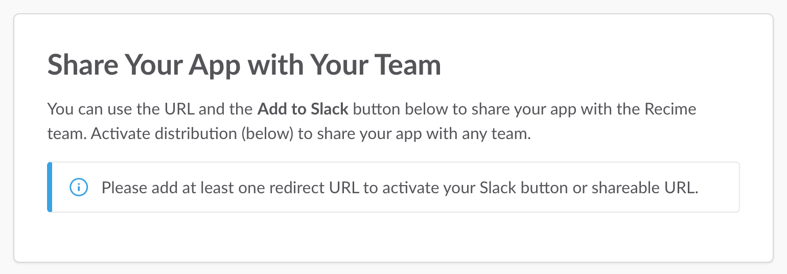
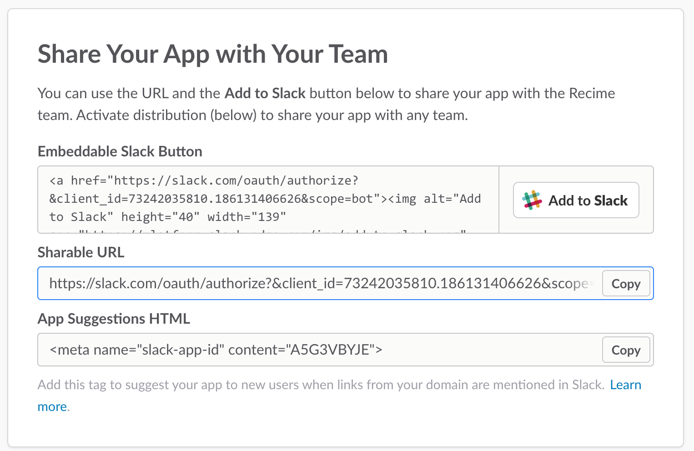
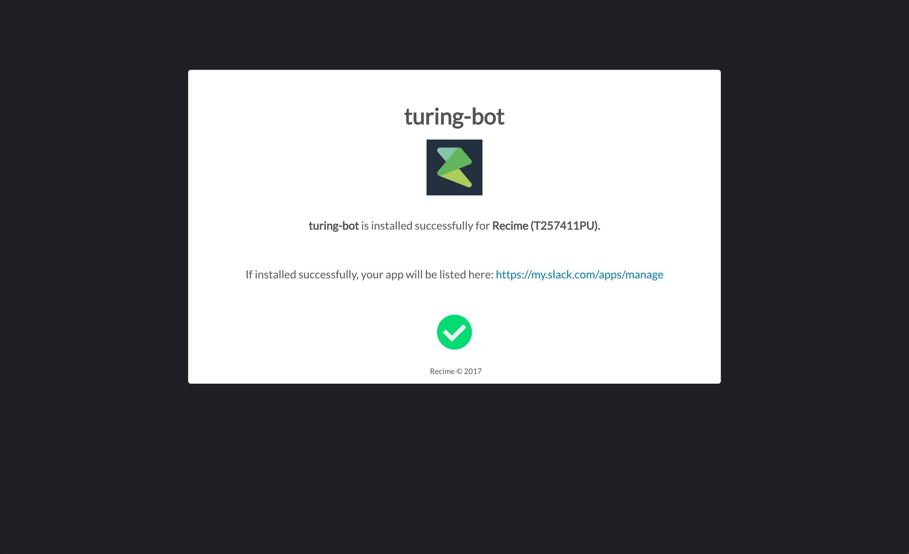

# Manage Distribution

In order to distribute slack app among teams. First step is to add a `redirect URL` to activate slack button or share link.

Under "Share Your App with Other Teams" set the `Recime` bot enpoint as `redirect URL` ad it will take care of the rest.

 

Click "Save URLs"

This will generate the `Add to Slack` button and `Shareable URL` both of which will initiate the OAuth process.

Once successful, it will install bot for the selected team and show you confirmation dialog like below:

To distribute the bot publicly, go to "Share Your App with Other Teams" and check "I’ve reviewed and removed any hard-coded information." under "Remove Hard Coded Information".

Click "Activate Public Distribution".

