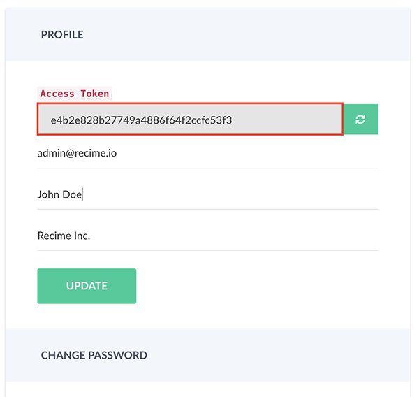

# Command Line Interface

`Recime Command Line Interface` requires [node](https://nodejs.org/en/) (version >=6.9.1) and uses `npm` as package manager.

You can create bots easily by using the `Recime` CLI. In order install the CLI, type following command:

```shell
npm install -g recime
```

Once the CLI is installed correctly, type the following to verify:

```shell
rbp --version
```

Next, go to [console.recime.io/my-account](https://console.recime.io/my-account) and copy the API Key to your clipboard.




Type the following command from your `macOS` terminal or `windows` comamnd prompt:

```shell
rbp login
```

Once verified, you will see the following confirmation:

```shell
~ rbp login
Paste your api key from "console.recime.io/my-account":
2880e1f07a2149509661d1ad19408d5b
| 

Logged in as: josh@recime.io

For any questions and feedback, please reach us at hello@recime.io.
~ 
```

Now you are all set and ready to create your first awesome bot!
