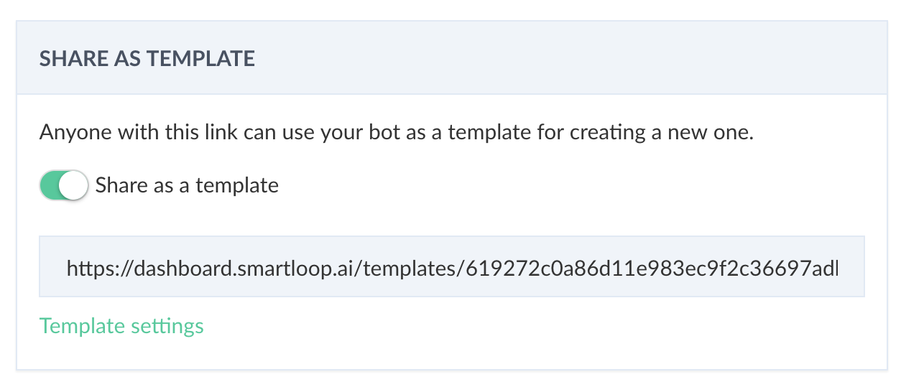

# How to Create Templates?

Every bot you create can be shared as a template. 

Whether you are working on a messenger, web or Viber bot or an individual, freelancer, or an agency, you can share your bot as a template with clients and community easily.

Similarly, you can reuse a marketing campaign or lead capture bot using templates.

Go to the bot settings and click on the "Share as a Template," this will prompt a dialog briefly describe your bot, upload icon, and add steps to use your template.

You can put this link on your website or social media, for anyone to take advantage of it. Once someone clicks on "Use Template" button (example below), they will be onboarded automatically and get their copy in their dashboard. They can then connect to Facebook or other channels with the click of a button.

By default, templates are private and are only available via the secure link.If you want to submit your template to our gallery, then please send us an email at [hello@smartloop.ai](hello@smartloop.ai)

