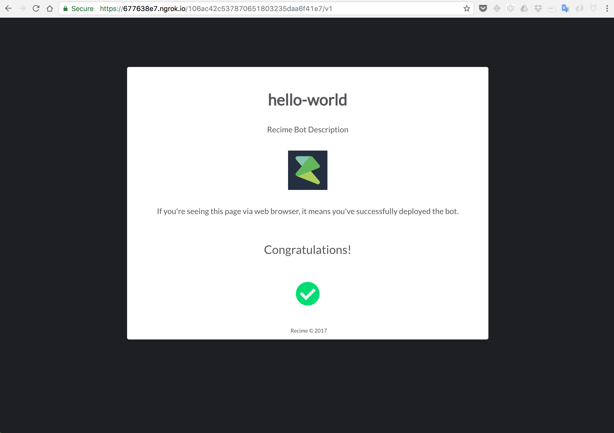

# Test

Once deployed, copy and paste the link in your browser and if everything is configured successfully then you should see the folowing page:




Now paste the following `curl` in your terminal app. Replace `{{url}}` with your bot link:  

```
curl -i -H "Accept: application/json" 
-H "Content-Type: application/json" -X POST {{url}} -w "\r\n"
```

This will give you the folloiwng output as it is in `main.js`:

```
{
    "text":"Hello! I'am a Recime bot. How may I help you?"
}
```
