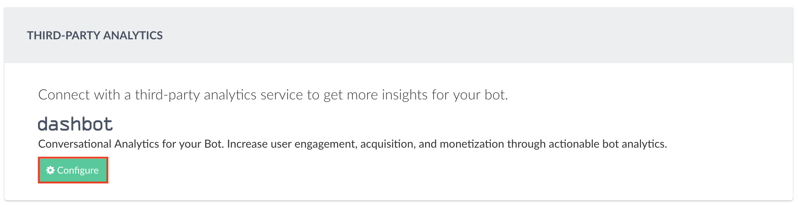

# Third-party Analytics

In order to get more insights for your bot, use the third-party analytics powered by [dashbot](https://dashbot.io).

Dashbot is the leading bot analytics service providing the the most accurate and in-depth insights for your bot conversation.

First step is to create a free account in [dashbot](https://dashbot.io) and then [add a skill](https://www.dashbot.io/bots):

Once the skill is created, it will generate an API key. Paste the API key as you configure dashbot analytics as shown below (home-> bot-> monitor):

