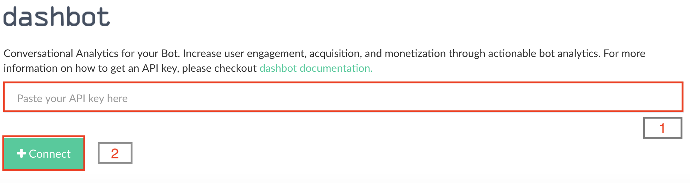

Third-Party Analytics
=====================

.. note ::
    Out of the box, integration is supported for Facebook. Integrations for Alexa and generic platform (e.g. website) are coming soon!

In order to get more insights for your bot, use the third-party
analytics powered by `dashbot`_.

Dashbot is the leading bot analytics service providing the the most
accurate and in-depth insights for your bot conversation.

|image0|

First step is to create a free account in
`dashbot <https://www.dashbot.io>`__ and then `add a skill`_:

|image1|

Once the skill is created, it will generate an API key. Paste the API
key as you configure dashbot analytics from `home->bot-> monitor` as shown below:

|image2|

.. _dashbot: https://dashbot.io
.. _add a skill: https://www.dashbot.io/bots

.. |image0| image:: dashbot.png
.. |image1| image:: add-skill.png
