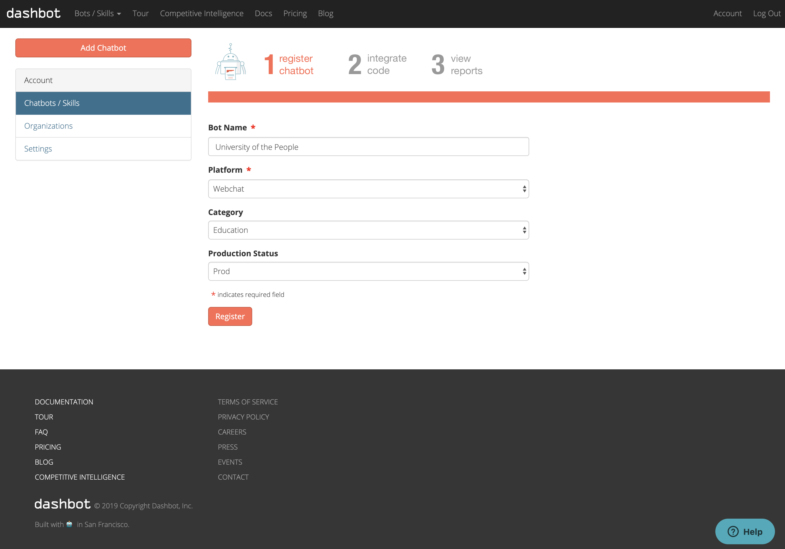
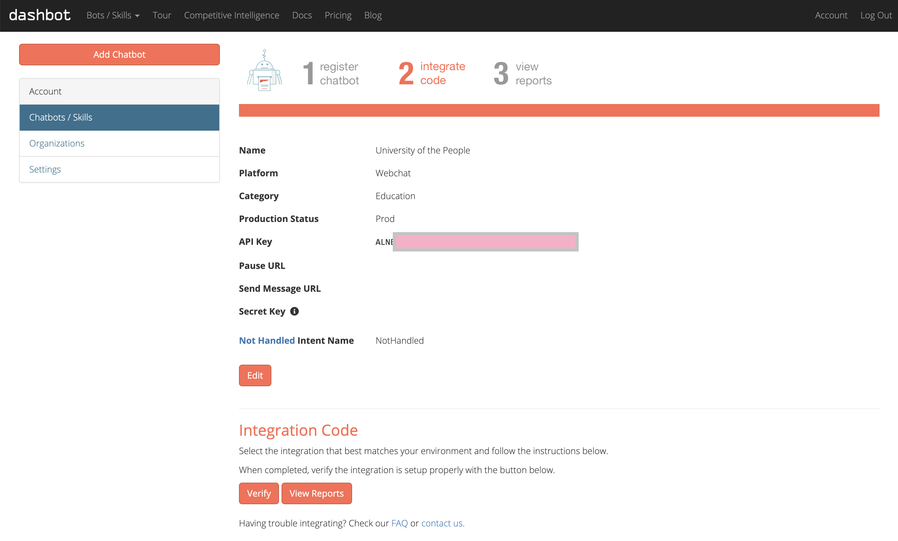
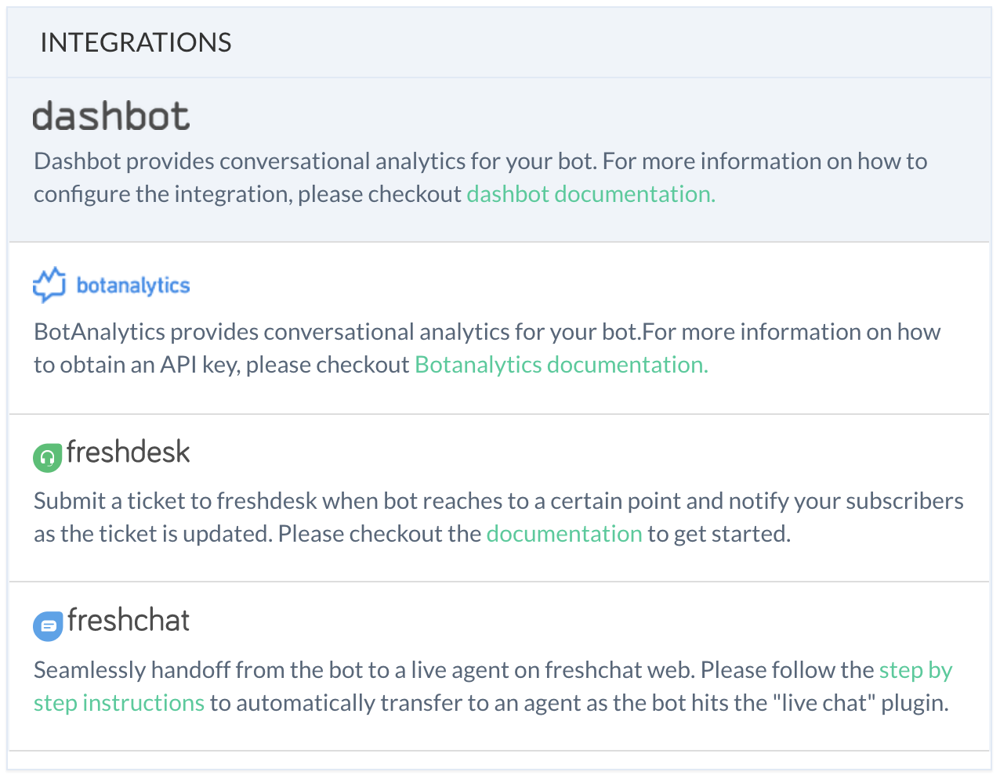
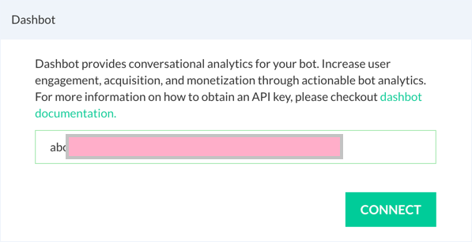

:::tip Note

The copyright/ trademark of individual third-party services mentioned here are owned by their respective companies.

:::

# Dashbot Integration

Dashbot provides comprehensive, conversational analytics to understand your subscribers and pin-point pitfalls. 

Below are the steps to configure and integrate Dashbot with Smartloop:

First,  go to [https://reports.dashbot.io/](https://reports.dashbot.io/) and sign up with your credentials.

Follow the instructions to register your bot:

Click "Register"

Copy the API Key from Step 2 and store it in a safe place to use in the next step.

Go to  **Configure-> Integrations**  Click on the "Dashbot" link:

This will bring up the configure modal, paste the API key you have copied eariler into the input box:

Click **Connect** and you are all set!

