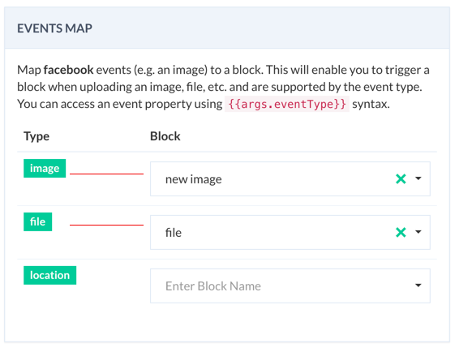

# Handling Input Events

::: warning Facebook and Viber Bots
Input events are currently supported for messenger and viber bots.
:::

Link an input event (e.g. user sends an image) to a block. Use this capability to handle and map an user event to a block.

Navigate to `Settings -> Events map` section.  Map an event to an existing block by selecting from the list as shown below:




The mapping event is available in the block as `args` property and can be accessed via: `args.eventType.property`

Below is a list of common properties for an event type:

| Type | Property | Comments |
| -- | -- | -- |
| image | url | url of the image |
| file | url | url of the file | 
| location | lat, long | latitude and longitude of the location|

In addition, you can map the following user events to a block in a **Viber** bot:

| Type | Property | Comments |
| -- | -- | -- |
| conversation_started | event | when a user follow a Viber bot |
| subscribed | event | Triggered when user sends first message after `conversation_started` | 
| unsubscribed | event | When a user leaves the bot. Use this to remove user info, data, etc.|


For example, if a subscriber sends an image on a facebook bot, it can set as an image place holder in the following way:


::: tip 

A [mustache](http://mustache.github.io/) template is a string that contains any number of mustache tags. Smartloop adopts this most popular template format to process variables. Tags are indicated by the double mustaches that surround them. Here, in the above example triple parenthesis tells the compiler not to encode the url.

:::

Event types can be combined with `JSON API`, `go-to` or `script` blocks to perform various operations from verifying document to serve location-aware contents to your subscribers.


```javascript 
//script block
exports.handler = (context, done) => {
    console.log(context.args.image.url);
    done();
};
```