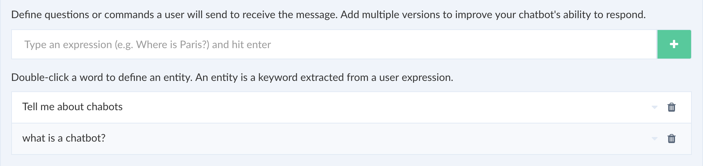

# What is an Intent?

Intent contains a group expressions that define the intention of an user input. 

Below is an example of expressions:

* Hi there!
* How's the weather in Paris?
* I want to travel from San Francisco to Madrid

An expression can be grouped into an intent and each intent has responses that will be sent out to the user. 

An Intent is context driven which is different from keyword-based systems where it will not recognize an expression or sentence if it is not an exact match. 

Here is an example of a context:

Here, I can say "What do you mean by a chatbot?" and it will still return correct intent since the context is same or I can ask "How's weather in London?". 

*Intents make your bot intelligent!*

An expression can also have entities that can tell the natural language processor to extract a certain part of the sentence that will let you do custom logic (advanced). 

In short, an Intent is a box full of expression and can have responses that are triggered by an user input or action.
