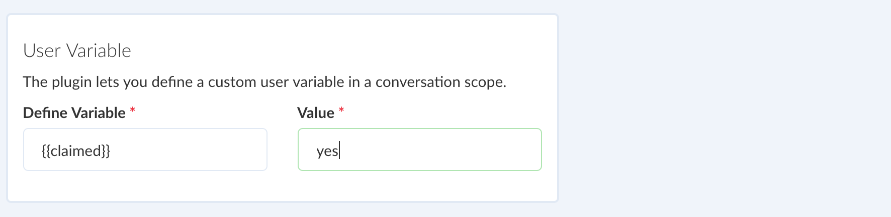
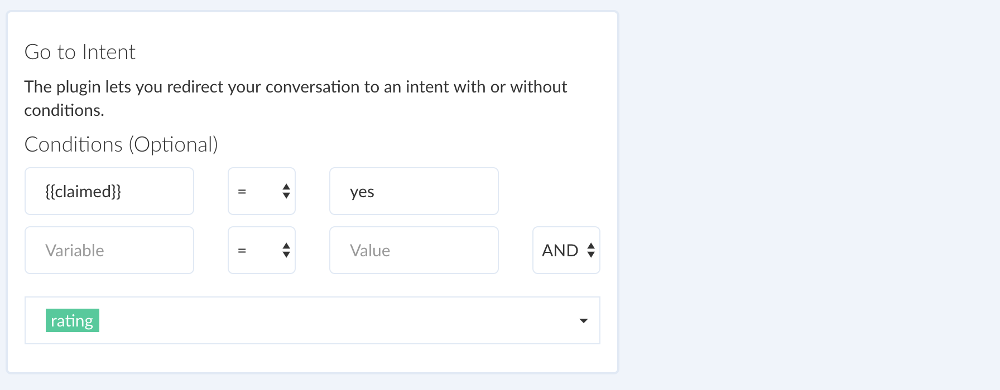

# Working with Variables

Use variables to store conversation state and identify a user. You can access a variable using the **double braces** syntax in the following way:

Here is a list of default variable names accessible from within the conversation scope by channel:

| Platform | Variable name | comments|
| -- | -- | -- |
| Facebook | first_name, last_name, profile_pic, gender, locale, timezone | -- |
| Viber | first_name, last_name, language, country | -- |
| Telegram | first_name, last_name | -- |
| Website | first_name, last_name, email, phone | These are placeholder for website bot and updated automatically when a value is set or updated using `website.setUser` |

::: tip  How to identify a user?
Use `user_id` to identify a user for a channel. It can be accessed within a block, either using a **double braces** syntax or from within the script via `context.args.user.id`
:::

It is also possible to define your own custom variables using `User Variable` plugin. 

Use variables to trigger a conditional flow as shown below:

Or as a filter criteria to send a broadcast (a.k.a. push notifications) to a specific group of subscribers:

