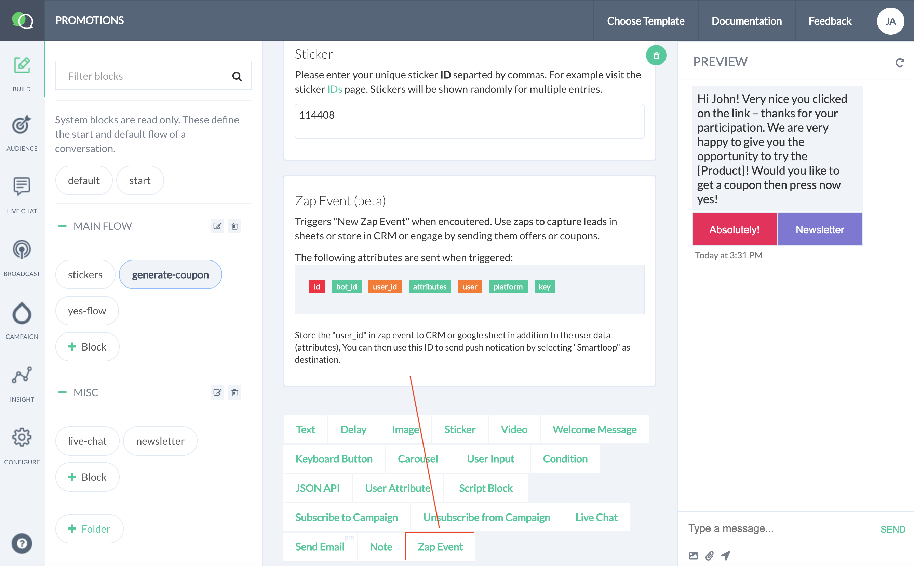
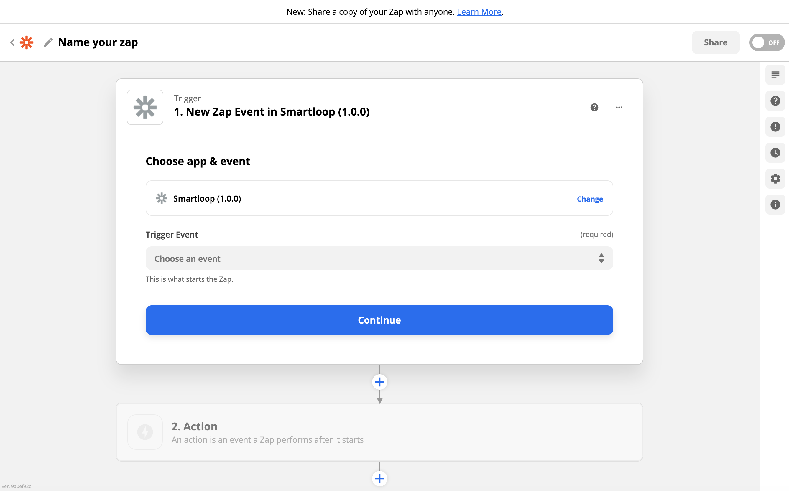
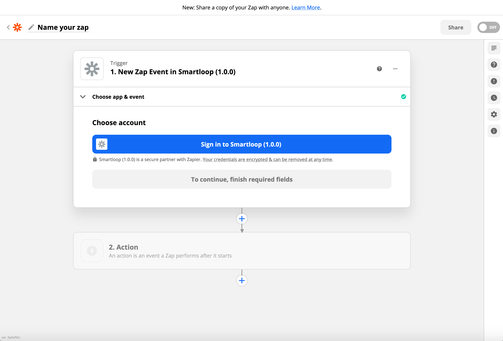
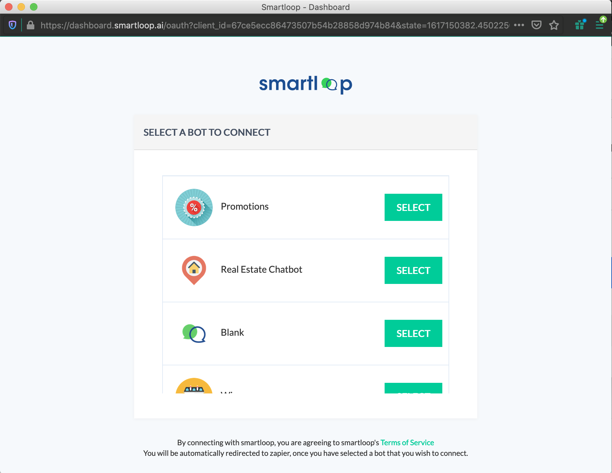
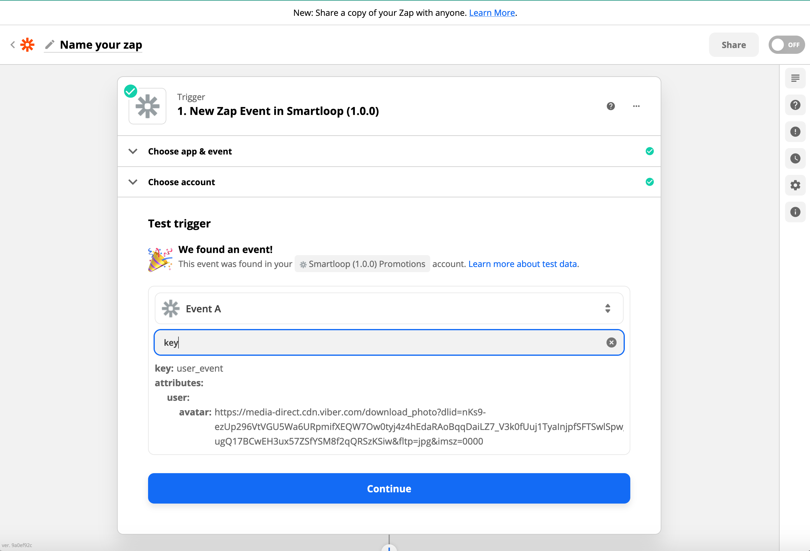
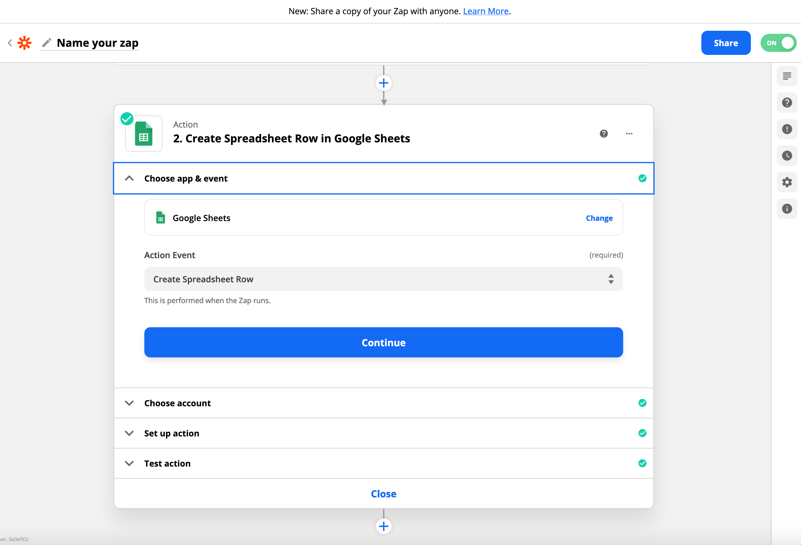
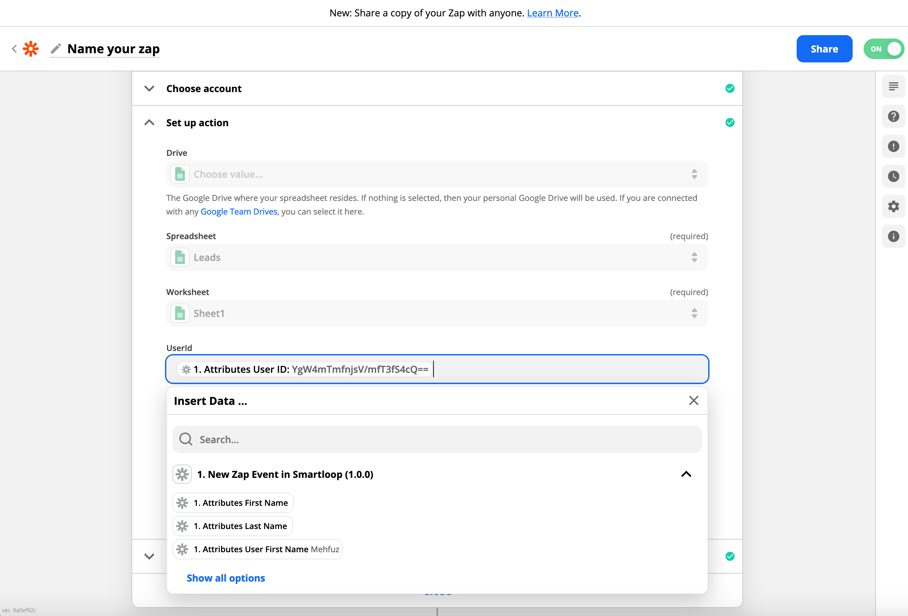
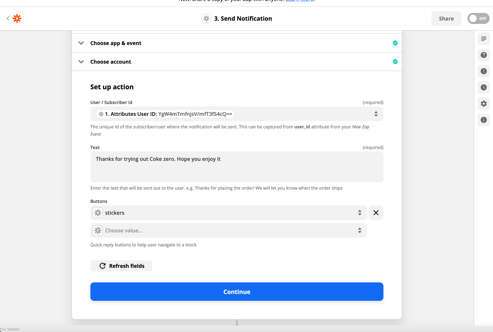
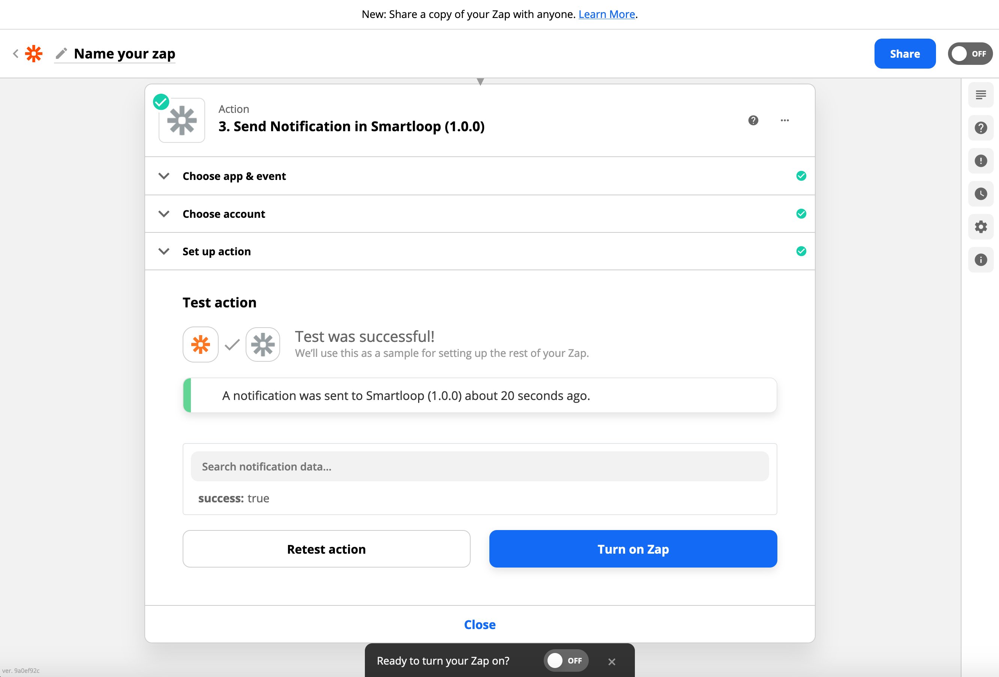

# Smartloop Zapier Integration

Connect your Smartloop Bot with Zapier to export your subscribers to google sheets, mailchimp, or save to CRM and keep your users posted on new updates about your producct or service.

There are two ways you can integrate with Zapier

* Export your subscribers via the "Zapier Event" plugin
* Send notification to a subscriber for status updates, offer coupon or promotions. 

Here, we will cover a basic flow on how you can export subscribers to a google sheet and then send a confirmation back to demonstrate the integration and setup

The very first step, while in the conversation builder, add the "Zapier Event" plugin to a block to trigger the event.

Next, go to [Zaiper](zapier.com) and create a new zap as shown here:

Select "New Zap Event" from the options and click "continue"

Click "Sign in to Smartloop", this will bring up the auth dialog and choose the bot you want to connect.

For this demo, I will select "Promotions Bot (created from the default templates)"

Test your trigger, you will need to reach to a conversation block in your bot where it hits plugin and once completed click on "Test Trigger"

Continue to complete the step.

Create a "Google sheets" step, to create a spreadsheet row, every time a new event is raised. 

Map the fields, you want to capture, in this demo we are just capturing the *user_id* and *active*:

We can turn on the zap at this step, however, we going to add an additional step that will send a notification to the user as a confirmation

Select "Send Notification" as an action event:

Next, create a map to the "user_id" we captured in step one:

Test and confirm that you have recevied the test event

Turn on the zap. 

At this point you have successfully configured your zap using smartloop conversation builder.

---

Please reach out to [support@smartloop.ai](mailto:support@smartloop.ai) , if you have questions or can't get through the steps and we will be happy to help you.
